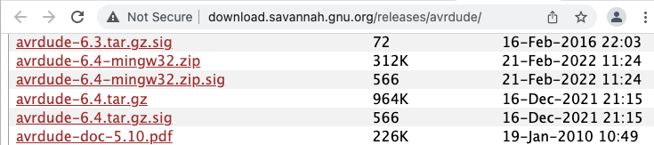
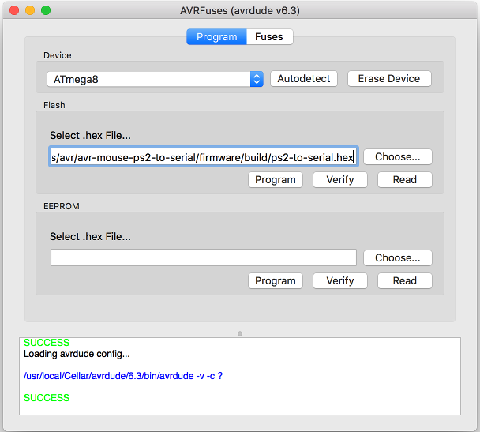

# Compile and Launch the project
```
$ ./build.bat
```
IN VSCODE:
```
CTRL+SHIFT+B
```

<br/>


# AVR Assembler Description PDF
https://drive.google.com/file/d/1-HsrVMXKgiQLN9OGbYNEb5PTsMOyhfUK/view?usp=sharing

<br/>


# on Mac OSX
## **Configure USBasp**

## Install libusb
https://macappstore.org/libusb/
```
$ ruby -e "$(curl -fsSL https://raw.githubusercontent.com/Homebrew/install/master/install)" 2> /dev/null

$ brew install libusb
```

## Instal AVRA (avr assembler)
alternate: https://macappstore.org/avra/

http://blog.translusion.com/posts/avrassembly/

- Download zip https://github.com/Ro5bert/avra
- Makefile edit: OS = osx
- go to folder /usr/local/bin/ and share folder
- $ make install

## Instal AVRDUDE (6.4)

- Download avrdude

link: [avrdude-link](http://download.savannah.gnu.org/releases/avrdude/)

- The default location of the install is into
```
/usr/local
````
- so you will need to be sure that
/usr/local/bin is in your PATH environment variable.
### To build and install: 
```
$ gunzip -c avrdude-6.4.tar.gz | tar xf -
$ cd avrdude-6.4
$ ./configure
$ make
$ su root -c ’make install’
```

If you do not have root access to your system, you can do the following instead:
```
$ gunzip -c avrdude-6.4.tar.gz | tar xf -
$ cd avrdude-6.4
$ ./configure --prefix=$HOME/local
$ make
$ make install
```

## AVRDUDEPROG for mac


link: [avrdude-prog-osx-link](https://github.com/trol73/AVRFuses/releases)

- Download zip
```
$ make install
```
<br><br><br><br>
# on Windows

## AVR_DUDE
link: [avr_dude_prog](https://www.yourdevice.net/proekty/avrdude-prog) <br>
link: [avr_dude](http://download.savannah.gnu.org/releases/avrdude/)
<br><br>
usage: avrasm32.exe [options] file.asm
```

 Options:
-f [O|M|I|G|-] output file format:
-fO Debug info for simulation in Atmel Studio (default)
-fO1 | -fO2 - force format version 1 or 2 (default: auto)
-fM Motorola hex -fI Intel hex -fG Generic hex format
-f- No output file -o ofile Put output in 'ofile'.
-d dfile Generate debug info for simulation in Atmel Studio in 'dfile'. Can only be used with
the -f [M|I|G] option.
-l lfile Generate listing in 'lfile'
-m mfile Generate map in 'mfile'
-e efile Place EEPROM contents in 'efile'
-w Relative jumps are allowed to wrap for program ROM up to 4k words in size [ignored]
-C ver Specify AVR core version
-c Case sensitive
-1/-2 Turn on/off AVR Assembler version 1 compatibility. [Deprecated]
-p1|0 Set/unset AVRASM1 implicit .device include (also set by -1) [Deprecated]
-I dir Preprocessor: Add 'dir' to include search path
-i file Preprocessor: Explicitly pre-include file
-D name[=value] Preprocessor: Define symbol. If =value is omitted, it is set to 1.
-U name Preprocessor: Undefine symbol.
-S file Produce include/label info file for Atmel Studio
-v verbosity [0-9][s]:
-vs Include target resource usage statistics
-vl Output low-level assembly code to stdout
-v0 Silent, only error messages printed
-v1 Error and warning messages printed
-v2 Error, warning, and info messages printed (default)
-v3-v9 Unspecified, increasing amounts of assembler internal dumps.
-V Format map and list files for Verilog.
-O i|w|e Overlap report: ignore|warning|error [error]
-W-b|+bo|+bi Byte operand out of range warning disable|overflow|integer
-W+ie|+iw Unsupported instruction error | warning
-W+fw Label slip caused by forward ref accepted (DANGEROUS)
-FD|Tfmt __DATE__ | __TIME__ format, using strftime(3) format string
```
