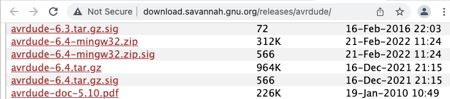
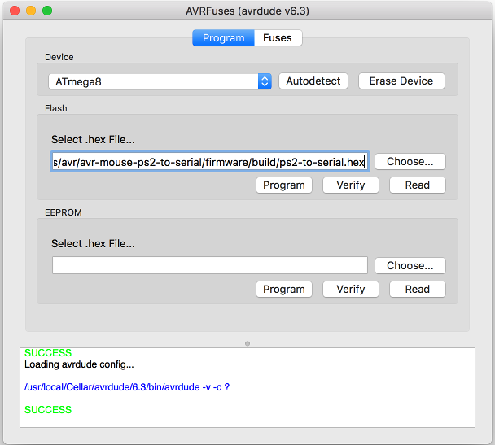

# **Configure USBasp**

## Install libusb on Mac OSX
https://macappstore.org/libusb/
```
$ ruby -e "$(curl -fsSL https://raw.githubusercontent.com/Homebrew/install/master/install)" 2> /dev/null

$ brew install libusb
```

## Instal AVRA (avr assembler)
alternate: https://macappstore.org/avra/

http://blog.translusion.com/posts/avrassembly/

- Download zip https://github.com/Ro5bert/avra
- Makefile edit: OS = osx
- go to folder /usr/local/bin/ and share folder
- $ make install

## Instal AVRDUDE (6.4)

- Download avrdude

link: [avrdude-link](http://download.savannah.gnu.org/releases/avrdude/)

- The default location of the install is into
```
/usr/local
````
- so you will need to be sure that
/usr/local/bin is in your PATH environment variable.
### To build and install: 
```
$ gunzip -c avrdude-6.4.tar.gz | tar xf -
$ cd avrdude-6.4
$ ./configure
$ make
$ su root -c ’make install’
```

If you do not have root access to your system, you can do the following instead:
```
$ gunzip -c avrdude-6.4.tar.gz | tar xf -
$ cd avrdude-6.4
$ ./configure --prefix=$HOME/local
$ make
$ make install
```

## AVRDUDEPROG for mac


link: [avrdude-prog-osx-link](https://github.com/trol73/AVRFuses/releases)

- Download zip
```
$ make install
```